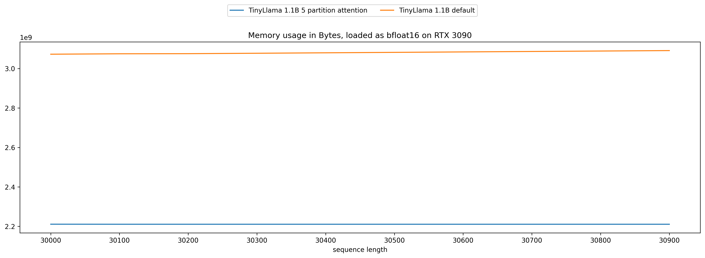

# more-memory-efficient

More memory efficient on top of Llama model!

1. Cross Layer KV, https://arxiv.org/pdf/2405.12981
2. Offload and partition Attention, derived from https://arxiv.org/abs/2402.05099

## Benchmark

### Cross Layer KV

**All models randomly initialized, zero training done**.

#### Memory usage

#### Time taken

### Offload and partition Attention

Tested using TinyLlama 1.1B.

