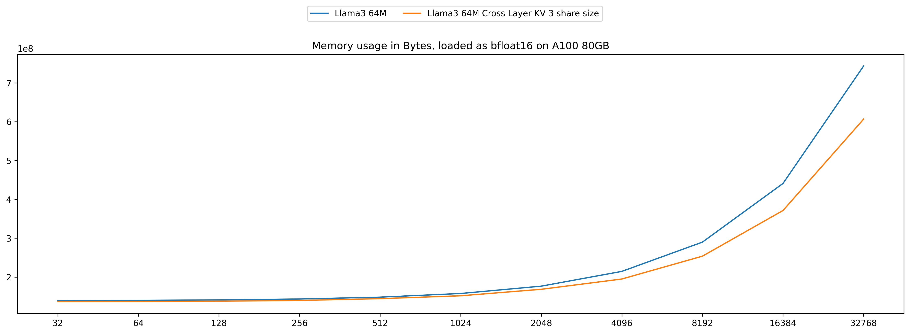
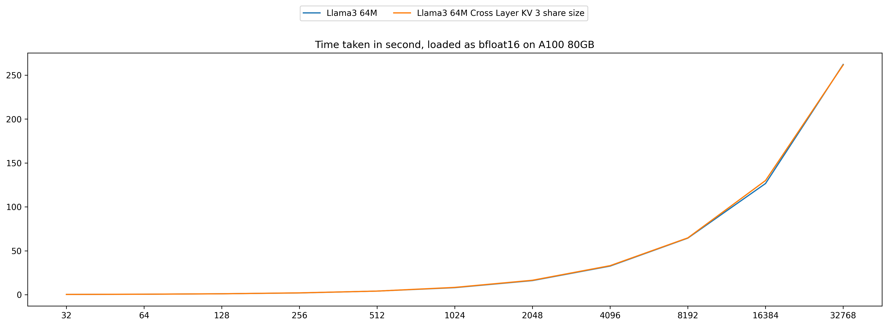

# more-memory-efficient

More memory efficient on top of available Decoder models! 

- Original source code DeepSeek V2 from https://huggingface.co/deepseek-ai/DeepSeek-V2
- Original source code Llama from https://raw.githubusercontent.com/huggingface/transformers/main/src/transformers/models/llama/modeling_llama.py

## Benchmark

**All models randomly initialized, zero training done**.

### Llama 3

#### Memory usage

#### Time taken

